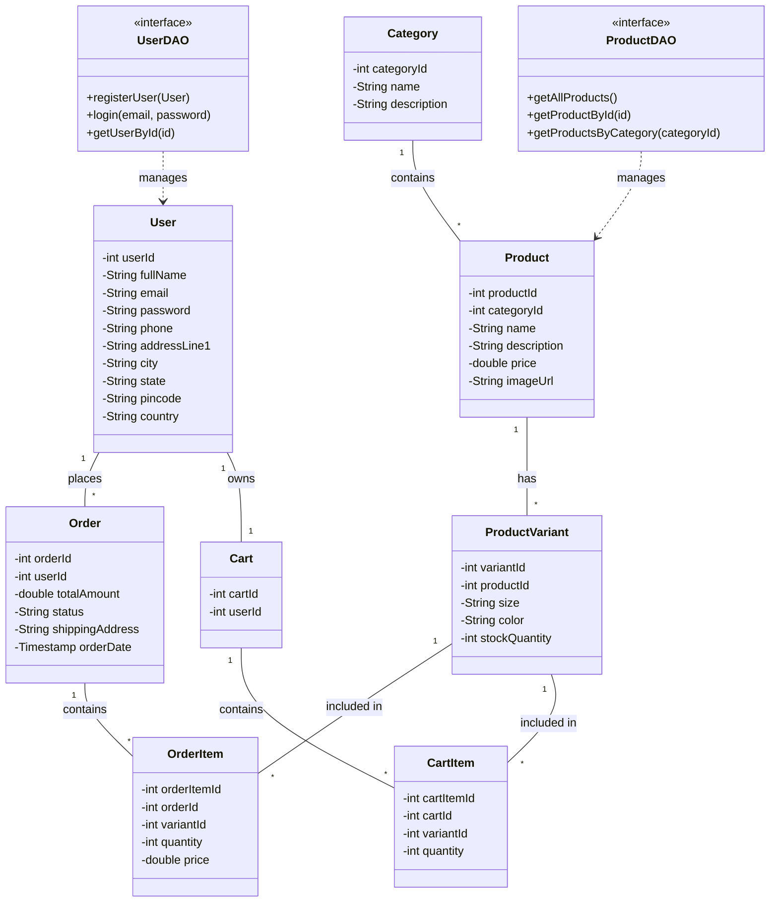
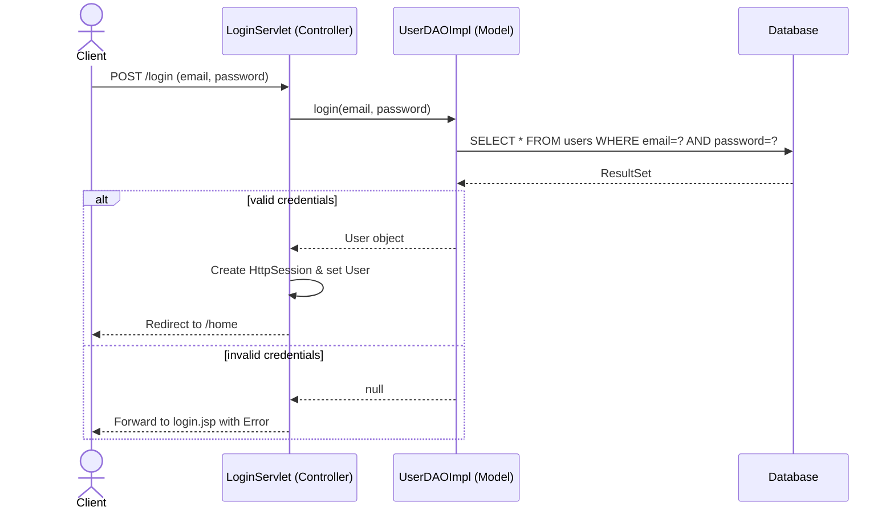
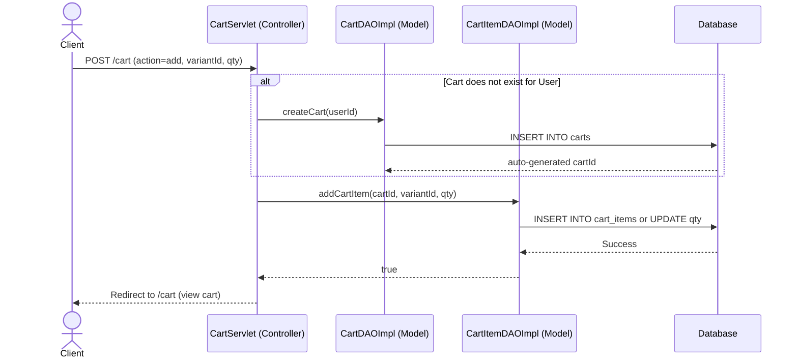
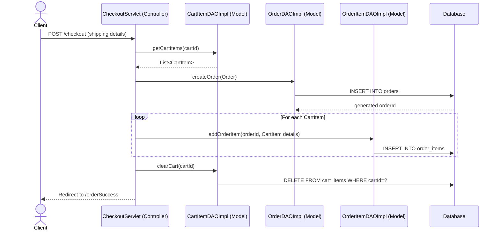

# FashionStore Architecture

The FashionStore application is built using a classic Model-View-Controller (MVC) architecture implemented with Java Servlets, JSP (assumed for views), and JDBC for database access.

## 1. MVC Design Pattern

The application strictly separates concerns into three distinct layers:

- **Model (Entities & DAOs)**: Located in `com.fashionstore.model` and `com.fashionstore.dao`. This layer represents the data structures (e.g., `User`, `Product`, `Order`) and the Data Access Objects (DAOs) responsible for interacting with the MySQL database using JDBC.
- **View (JSP/HTML)**: Handles the presentation logic. It receives data from the controllers and renders it to the user.
- **Controller (Servlets)**: Located in `com.fashionstore.controller`. Servlets like `LoginServlet`, `ProductServlet`, and `CheckoutServlet` act as the orchestrators. They intercept HTTP requests, process user input, interact with the DAOs to manipulate data, and forward the response to the appropriate View.

---

## 2. Class Diagram

The following diagram illustrates the relationships between the core entity classes and their corresponding Data Access Objects.

---

## 3. Sequence Diagrams

### 3.1 User Login Flow
This diagram shows the process when a user attempts to log in.

### 3.2 Add to Cart Flow
This diagram illustrates the flow when a user adds a specific product variant to their shopping cart.

### 3.3 Checkout & Order Placement Flow
This diagram shows the process of checking out and converting a cart into an order.

