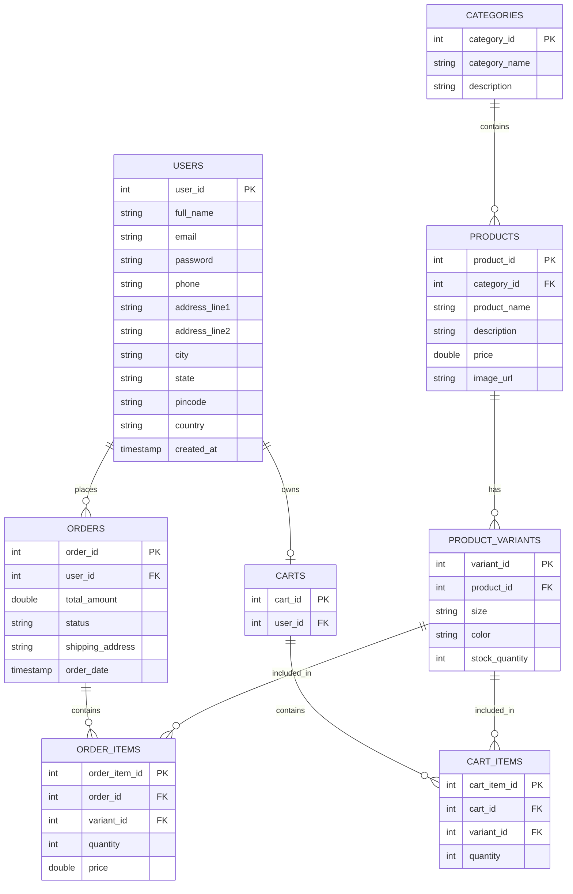

# FashionStore Database Schema

This document details the database schema for the FashionStore project, including table structures, relationships, and their corresponding Java Model classes.

## 1. Entity Relationship Diagram (ERD)

The following diagram illustrates the relationships between the various tables in the database.

---

## 2. Table Definitions & Class Mappings

### 2.1 Table: `users`
Stores all registered customer information.
- **Java Model Class**: `com.fashionstore.model.User`
- **Columns**:
  - `user_id` (INT, Primary Key, Auto Increment)
  - `full_name` (VARCHAR)
  - `email` (VARCHAR, Unique)
  - `phone` (VARCHAR, Unique)
  - `password` (VARCHAR)
  - `address_line1` (VARCHAR)
  - `address_line2` (VARCHAR)
  - `city` (VARCHAR)
  - `state` (VARCHAR)
  - `pincode` (VARCHAR)
  - `country` (VARCHAR)
  - `created_at` (TIMESTAMP)

### 2.2 Table: `categories`
Stores product categories (e.g., Men, Women, Kids, Accessories).
- **Java Model Class**: `com.fashionstore.model.Category`
- **Columns**:
  - `category_id` (INT, Primary Key, Auto Increment)
  - `category_name` (VARCHAR)
  - `description` (TEXT)

### 2.3 Table: `products`
Stores the main product details.
- **Java Model Class**: `com.fashionstore.model.Product`
- **Columns**:
  - `product_id` (INT, Primary Key, Auto Increment)
  - `category_id` (INT, Foreign Key referencing `categories.category_id`)
  - `product_name` (VARCHAR)
  - `description` (TEXT)
  - `price` (DOUBLE)
  - `image_url` (VARCHAR)

### 2.4 Table: `product_variants`
Stores specific variations of a product, such as size and color combinations, along with stock.
- **Java Model Class**: `com.fashionstore.model.ProductVariant`
- **Columns**:
  - `variant_id` (INT, Primary Key, Auto Increment)
  - `product_id` (INT, Foreign Key referencing `products.product_id`)
  - `size` (VARCHAR)
  - `color` (VARCHAR)
  - `stock_quantity` (INT)

### 2.5 Table: `orders`
Stores order headers placed by users.
- **Java Model Class**: `com.fashionstore.model.Order`
- **Columns**:
  - `order_id` (INT, Primary Key, Auto Increment)
  - `user_id` (INT, Foreign Key referencing `users.user_id`)
  - `total_amount` (DOUBLE)
  - `status` (VARCHAR) - e.g., 'PENDING', 'SHIPPED', 'DELIVERED'
  - `shipping_address` (TEXT)
  - `order_date` (TIMESTAMP)

### 2.6 Table: `order_items`
Stores the individual items (variants) purchased within an order.
- **Java Model Class**: `com.fashionstore.model.OrderItem`
- **Columns**:
  - `order_item_id` (INT, Primary Key, Auto Increment)
  - `order_id` (INT, Foreign Key referencing `orders.order_id`)
  - `variant_id` (INT, Foreign Key referencing `product_variants.variant_id`)
  - `quantity` (INT)
  - `price` (DOUBLE) - Price at the time of purchase.

### 2.7 Table: `carts`
Stores active shopping cart sessions for users.
- **Java Model Class**: `com.fashionstore.model.Cart`
- **Columns**:
  - `cart_id` (INT, Primary Key, Auto Increment)
  - `user_id` (INT, Foreign Key referencing `users.user_id`)

### 2.8 Table: `cart_items`
Stores the specific product variants added to a shopping cart.
- **Java Model Class**: `com.fashionstore.model.CartItem`
- **Columns**:
  - `cart_item_id` (INT, Primary Key, Auto Increment)
  - `cart_id` (INT, Foreign Key referencing `carts.cart_id`)
  - `variant_id` (INT, Foreign Key referencing `product_variants.variant_id`)
  - `quantity` (INT)
